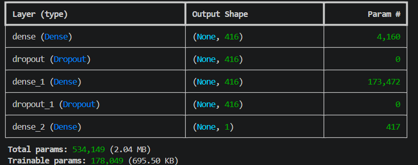

# GoIT Final Project
Final project for the Python Data Science and Machine Learning course.

## Project Goal
The goal of this project was to create a model capable of predicting customer churn for a service using historical customer data.

## Task Implementation According to the Project Goal
First, we loaded the dataset and performed initial data preprocessing, which included data visualization, descriptive statistical analysis, duplicate removal, handling missing values, and other preprocessing steps. These stages were implemented in the `01_train_model.py` file.
In this document, we also trained two different classification algorithms in order to compare their classification accuracy: an SGD Classifier and a Neural Network. Cross-validation was used for hyperparameter tuning. The neural network achieved the best performance, so it was selected as the final model for classifying new customers.

Neural network hyperparameter tuning was performed using the KerasTuner module. Accordingly, all randomly generated neural network configurations are stored in the `my_dir` folder. Each `trial` directory contains the hyperparameters used to train two neural networks with different weight initializations. In total, 15 trials were conducted, meaning 30 neural networks were trained. The best model achieved the following performance metrics: accuracy - 0.92, precision - 0.92, recall - 0.92, F1-score - 0.92.

The resulting neural network had the following architecture:


## Project File Structure

* `my_dir` - folder containing the KerasTuner results
* `01_train_model.py` — script responsible for initial data preprocessing and model training
* `02_streamlit.py` — script for building the user interface
* `.dockerignore` and `Dockerfile` — files containing information for creating the Docker image and containerizing the project
* `internet_service_churn.csv` — dataset containing information about all customers
* `model_summary.png` — image of the neural network architecture
* `my_best_model.keras` — file containing the neural network with the best hyperparameters and classification performance
* `poetry.lock` and `pyproject.toml` — files storing information about the installed and used modules in this project when using the Poetry virtual environment
* `requirements.txt` — file containing a general list of all required Python packages
* `scaler.pkl` — file containing the scaler parameters fitted on the training data for use during future data standardization

## Running the Model Using a Docker Container

Start Docker Desktop on your computer.

First, clone the project repository to your computer. This can be done through the system terminal depending on your operating system.

* Windows: Press `Win + R`, type `cmd`, and press `Enter`.
* macOS: Press `Cmd + Space` to open Spotlight Search, type `Terminal`, and press `Enter`.
* Linux: Press `Ctrl + Alt + T`

Open the terminal and run:
```bash
git clone https://github.com/smatkovamaria8-collab/Final-project-02---Churn-prediciton.git
```
Navigate to the project directory:

```bash
cd Final-project-02---Churn-prediciton
```

Build the Docker image:
```bash
docker build . -t prediction-app
```

Run the container:
```bash
docker run -p 8501:8501 prediction-app
```
Open the Local URL displayed in the terminal.


## Usage Instructions

In the opened web browser, you can enter the data of the customer whose churn probability you want to predict.

* Fill in all input fields according to the instructions displayed on the website.
* After completing all fields, click the “Predict Churn” button.
* The application will display the predicted customer churn probability in text format along with a corresponding chart.

To stop the application, press `Ctrl + C` in the terminal.
